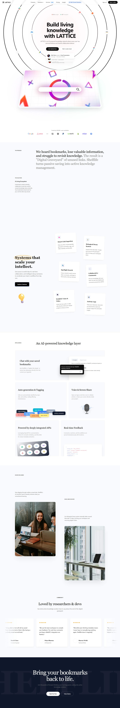
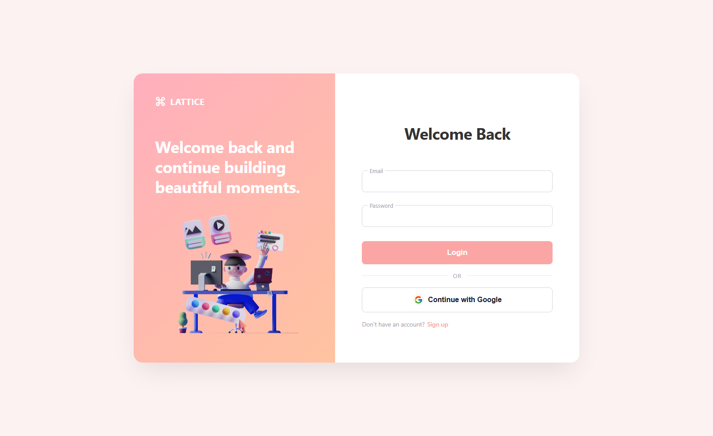
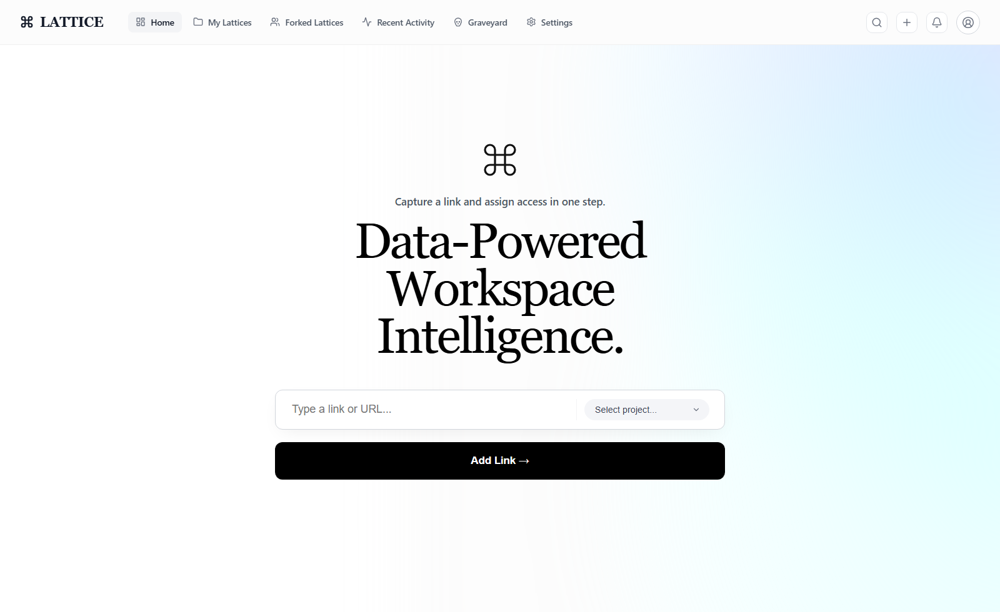
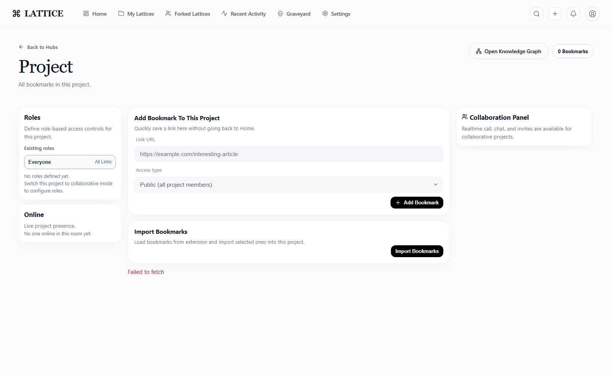

# LATTICE

LATTICE is a full-stack knowledge workspace that transforms passive bookmarking into an active, collaborative system.
Teams can collect links, discuss context, apply role-based access, track content evolution, and manage link lifecycle with biological decay mechanics.

## Product Overview

LATTICE is designed to solve three common problems in knowledge-heavy workflows:

1. Information overload from unstructured saved links.
2. Collaboration gaps between individuals and teams.
3. Loss of relevance when saved content is never revisited.

The platform combines AI-assisted metadata, collaborative project spaces, real-time communication, and lifecycle governance (decay and graveyard recovery) into one operational workspace.

## Screenshots

### Landing Experience



### Authentication Flow



### Main Workspace Home



### Project Workspace



## Core Features

### 1. Authentication and Identity

- Email/password registration and login.
- Google OAuth integration.
- Current-user profile endpoint for session hydration.
- Profile settings with bio, social links, and personal decay thresholds.

### 2. Project and Workspace Management

- Personal and collaborative project types.
- Per-project ownership and membership model.
- Visibility controls for public/private lattice discovery.
- Project lineage metadata for remixes and forks.

### 3. Bookmark Ingestion and Intelligence

- Add links directly into a selected project.
- Metadata enrichment pipeline (title/summary/media).
- Role-based or public access policies on links.
- Link comments and collaborative discussion threads.

### 4. Biological Decay and Graveyard Recovery

- Inactivity tracking per link.
- Decay window rendering between configured thresholds.
- Automatic transition from active -> decaying -> dead.
- Recoverable graveyard for deleted/expired links.
- Restore workflow to reactivate archived knowledge.

### 5. Roles and Access Governance

- Role definitions for collaborative projects.
- Owner-only role creation controls.
- Permission levels: full access, restricted access, view only.
- Role-aware link visibility and collaboration boundaries.

### 6. Fork and Activity System

- Public lattice discovery.
- Fork/remix of public projects.
- Forked lattice listing.
- Activity feed for:
  - forks created by you,
  - updates on your forks,
  - forks created from your projects.

### 7. Realtime Collaboration Layer

- Socket.IO rooms for live project presence.
- Live chat, reactions, and cursor telemetry.
- WebRTC signaling for call/collaboration panel.
- Redis-backed distributed synapse for cross-node realtime alignment.

## Technical Architecture

### Frontend

- React + Vite.
- Route-level protection for authenticated workspaces.
- Modular pages for Home, Projects, Graveyard, Activity, Settings.
- Shared API service layer with JWT-based authorization.

### Backend

- Node.js + Express APIs.
- MongoDB + Mongoose domain models.
- JWT authentication middleware.
- Controllers organized by feature domain.
- Socket.IO for bidirectional realtime events.
- Redis adapter for multi-instance realtime synchronization.

### Data Domains

- Users.
- Projects and project members.
- Roles and permissions.
- Links and access scopes.
- Invites.
- Comments and messages.
- Timeline/pulse/change insights.
- Remix lineage and activity.

## API Surface (High-Level)

- `/api/auth` - register/login/me/google auth.
- `/api/users` - profile and settings updates.
- `/api/projects` - create/list/membership.
- `/api/links` - create/list/view/delete/restore/graveyard.
- `/api/roles` - role creation and listing.
- `/api/invites` - project invitations.
- `/api/comments` - discussion comments.
- `/api/search` - spotlight and discovery.
- `/api/remix` - public projects, forking, lineage, activity.
- `/api/timeline` and `/api/pulse` - content evolution and summaries.
- `/api/graph` and `/api/lattice` - graph and lattice-level endpoints.

## Repository Structure

```text
.
|- backend/
|  |- controllers/
|  |- middlewares/
|  |- models/
|  |- routes/
|  |- services/
|  |- utils/
|  `- index.js
|- frontend/
|  |- src/
|  |  |- Pages/
|  |  |- components/
|  |  `- services/
|  `- index.html
|- docs/
|  `- screenshots/
`- README.md
```

## Local Development Setup

### 1. Backend

```bash
cd backend
npm install
```

Create `backend/.env`:

```env
PORT=8000
MONGO_URI=your_mongodb_connection_string
JWT_SECRET=your_jwt_secret
FRONTEND_URL=http://127.0.0.1:5173

# Optional OAuth
GOOGLE_CLIENT_ID=...
GOOGLE_CLIENT_SECRET=...
GOOGLE_CALLBACK_URL=http://localhost:8000/api/auth/google/callback

# Optional distributed realtime (recommended for multi-node)
REDIS_URL=...
# or UPSTASH_REDIS_URL=...
# or UPSTASH_REDIS_REST_URL + UPSTASH_REDIS_REST_TOKEN
```

Run backend:

```bash
npm run dev
```

### 2. Frontend

```bash
cd frontend
npm install
npm run dev
```

Build frontend:

```bash
npm run build
```

## Deployment Setup (Render + Vercel)

Use this configuration for the deployed stack:

- Frontend: https://lattice-cyan.vercel.app
- Backend: https://se-hack.onrender.com

### Render (backend) environment variables

- PORT=8000
- MONGO_URI=...
- JWT_SECRET=...
- FRONTEND_URL=https://lattice-cyan.vercel.app
- FRONTEND_ORIGINS=https://lattice-cyan.vercel.app
- GOOGLE_CLIENT_ID=...
- GOOGLE_CLIENT_SECRET=...
- GOOGLE_CALLBACK_URL=https://se-hack.onrender.com/api/auth/google/callback
- GROQ_API_KEY=...
- AGORA_APP_ID=...
- AGORA_APP_CERTIFICATE=... (or AGORA_CHANNEL_CERTIFICATE=...)

Optional realtime scaling:

- REDIS_URL=... or UPSTASH_REDIS_URL=... or UPSTASH_REDIS_REST_URL + UPSTASH_REDIS_REST_TOKEN

### Vercel (frontend) environment variables

- VITE_API_BASE_URL=https://se-hack.onrender.com/api
- VITE_SOCKET_URL=https://se-hack.onrender.com
- VITE_AGORA_APP_ID=... (must match Render AGORA_APP_ID)
- VITE_AGORA_FORCE_NO_TOKEN=false
- VITE_AGORA_ALLOW_TEMP_TOKEN_FALLBACK=false

For robust cross-network WebRTC calls, also add TURN-capable ICE servers:

- VITE_ICE_SERVERS=[{"urls":["stun:stun.l.google.com:19302","stun:stun1.l.google.com:19302"]},{"urls":"turn:global.relay.metered.ca:80","username":"YOUR_USER","credential":"YOUR_PASS"},{"urls":"turn:global.relay.metered.ca:443","username":"YOUR_USER","credential":"YOUR_PASS"},{"urls":"turns:global.relay.metered.ca:443","username":"YOUR_USER","credential":"YOUR_PASS"}]

After setting variables, redeploy both services.

### Google OAuth redirect URI

In Google Cloud Console, for the OAuth client used by this app, add:

- Authorized redirect URI: https://se-hack.onrender.com/api/auth/google/callback

Without this exact value, Google auth returns redirect_uri_mismatch.

### Vercel SPA routing

The frontend uses BrowserRouter, so Vercel requires an SPA rewrite file at frontend/vercel.json that rewrites all paths to /index.html.

If Vercel is configured to deploy from repository root instead of the Frontend directory, a root vercel.json is also provided so build/install/output resolve to Frontend automatically.

Without this rewrite, auth callback redirects like /login?token=... can return 404 NOT_FOUND.

## Realtime and Media Notes

- Chat and room presence can work even when media fails.
- WebRTC across different networks generally requires TURN, not STUN-only.
- The call panel now supports websocket and polling fallback and queues ICE candidates until remote description is available.

## TTS and Podcast Notes

- The previous playai-tts model is deprecated.
- Current default TTS model is canopylabs/orpheus-v1-english.
- Orpheus requires response_format: wav and valid voices such as autumn, diana, hannah, austin, daniel, or troy.
- Podcast download and content type are aligned to WAV output.

## Health and Verification

- `GET /` confirms backend service startup.
- `GET /health` returns `{ "ok": true }`.
- Frontend served at `http://127.0.0.1:5173` in local dev.

## Current Realtime Note

The project now includes a Redis distributed synchronization layer for realtime telemetry and cross-instance Socket.IO event propagation. In single-node local mode, it automatically falls back to in-memory behavior when Redis is not configured.